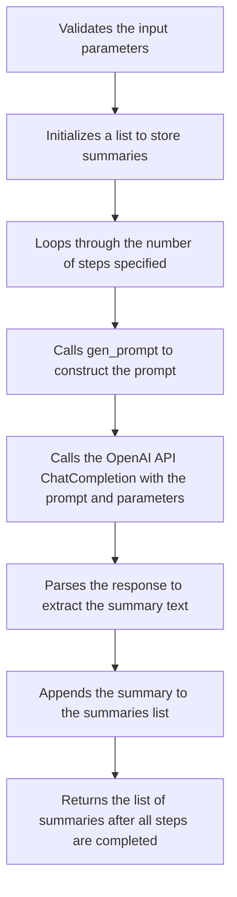
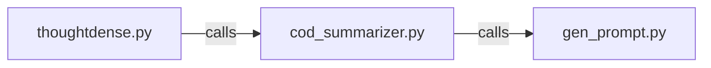

# thoughtdense

## Description

Author: Raphaël MANSUY

## Overview

thoughtdense analyzes text and generates a concise summary using Chain Of Density technique as described in the paper [From Sparse to Dense:
GPT-4 Summarization with Chain of Density Prompting](https://arxiv.org/abs/2309.04269).


## cod-summarizer

This is a Python module for generating multi-step summaries of documents using the Chain Of Density.

## Usage

```python
import cod_summarizer

document = "Article text..."

summaries = cod_summarizer.cod_summarize(document, steps=3)
```

This will generate 3 increasingly concise summaries using the CoD prompt.

The `cod_summarize()` function takes the following arguments:

- `document` - The text of the document to summarize.
- `steps` - The number of summarization steps to perform, between 1 and 5. Default is 3.
- `debug` - Print intermediate summaries if True. Default is False.

It returns a list of summary texts generated at each step.

## Example

```python
import cod_summarizer

text = "Some long text to summarize..."

summaries = cod_summarizer.cod_summarize(text, steps=2)

print(summaries[0]) # Initial verbose summary
print(summaries[1]) # Final concise summary
```

## Prompt Engineering

The module constructs a CoD prompt tailored for summarization, with instructions for an initial verbose summary and iterative improvements asking the model to add missing entities.

The prompt structure and engineering details are encapsulated in the `gen_prompt()` function.

## Usage as a CLI command

```bash
Usage: toughtdense.py summarize [OPTIONS] FILENAME

  Generate a summary of a document using the CoD prompt.

Options:
  --steps INTEGER RANGE  Number of steps.  [default: 5; 1<=x<=5]
  --debug BOOLEAN        [default: False]
  --help                 Show this message and exit.
```

### Example

```bash
python thoughtdense.py summarize --steps 3 --debug True ./demo/demo.txt
```

### Pre-requisites

- Python 3.8 or higher
- OpenAI API key (set as environment variable OPENAI_API_KEY)

## Structure of the repository

- `thoughtdense.py` - CLI command for summarizing a document using the CoD prompt.
- `cod_summarizer.py` - Python module for generating multi-step summaries of documents using the Chain Of Density
- `demo` - Demo files

## How it works

The program defines several constants at the top that provide guidelines for the AI assistant on how to generate summaries in each step.

VERBOSITY_GUIDELINES provides instructions to make the first summary very verbose and non-specific.

FUSION_INSTRUCTIONS tells the AI to improve flow and make space for more entities in later steps.

ENTITY_CONSTRAINTS defines what makes a good "Missing Entity" to add in each step.

RESULT_FORMAT shows the expected JSON output containing the summary text and missing entities.

The gen_prompt() function constructs the prompt to send to the AI by formatting the input document and previous summary along with the guideline constants.

The cod_summarize() function is the main entry point. It:

- Validates the input parameters
- Initializes a list to store summaries
- Loops through the number of steps specified
- Calls gen_prompt() to construct the prompt
- Calls the OpenAI API (ChatCompletion) with the prompt and parameters
- Parses the response to extract the summary text
- Appends the summary to the summaries list
- Returns the list of summaries after all steps are completed

 So in summary, it generates an initial verbose summary, then iteratively constructs prompts asking the AI to summarize again while adding specific missing entities in each step. The result is multiple increasingly condensed summaries focusing on key details.


 

## Architecture diagram



## To Do

- [ ] Add tests
- [ ] Add support to use other models than GPT-X
- [ ] Better prompt engineering
